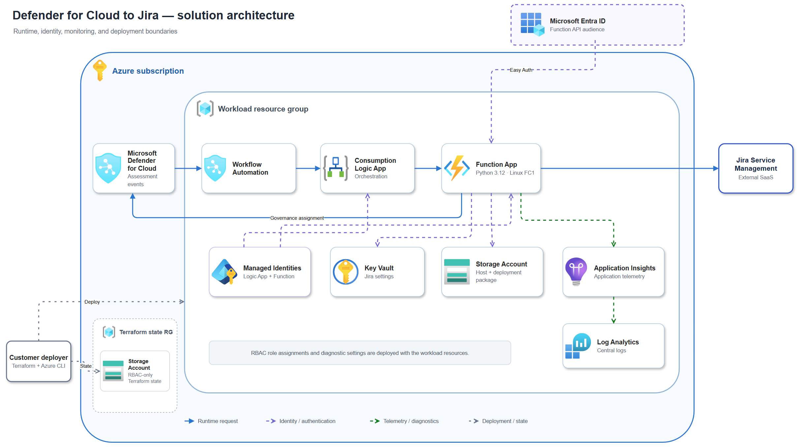
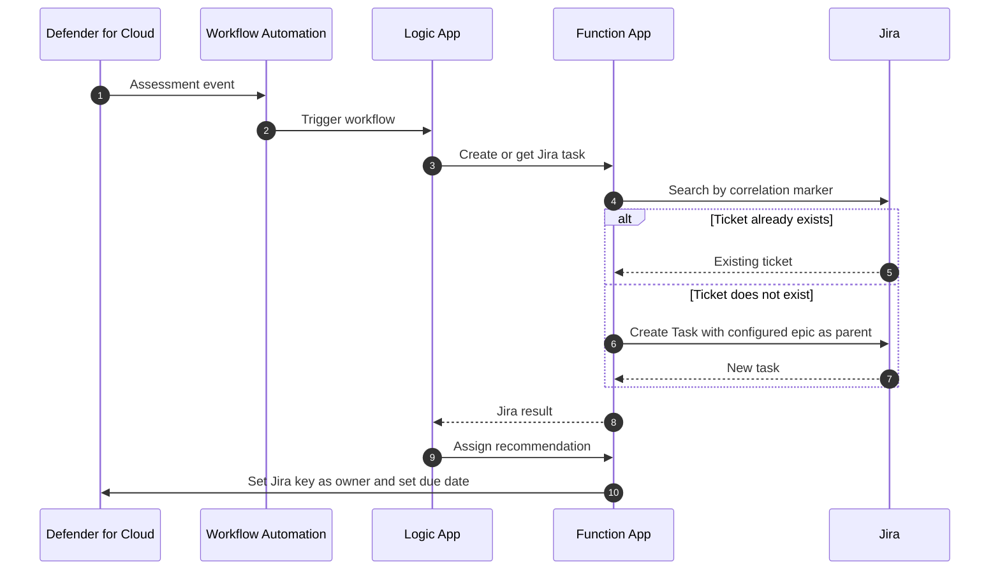

# Defender for Cloud to Jira

This solution turns a Microsoft Defender for Cloud recommendation into a Jira Task under one configured existing epic. It creates a task when a matching ticket does not exist, reuses the existing ticket on replay, and writes the Jira issue key to the Defender recommendation owner with a severity-based due date. Jira Service Management is not required.

The customer supplies the Azure environment values, Jira project details, and remediation time frames for their environment. Jira credentials are stored in Azure Key Vault and are not written to Terraform state.

## Architecture

[](docs/architecture/defender-jira-architecture.drawio)

Select the image to open the editable [draw.io source](docs/architecture/defender-jira-architecture.drawio). The diagram uses official Azure service icons under the [Microsoft Azure architecture icon terms](https://learn.microsoft.com/azure/architecture/icons/).

## Request Flow



Workflow Automation is scoped to Defender assessment events for the subscription. No status or severity filter is currently configured.

## Azure Resources

Terraform deploys the following resources:

| Resource | Purpose |
| --- | --- |
| Resource group | Contains the integration resources |
| Defender for Cloud Workflow Automation | Sends recommendations to the Logic App |
| Consumption Logic App | Runs the two-step Jira and Defender request flow |
| Linux Flex Consumption plan and Function App | Hosts the Python integration API |
| Two user-assigned managed identities | Separate Function and Logic App access |
| Microsoft Entra application and service principal | Protect the Function API |
| Key Vault | Stores five Jira settings as secrets, including the API token |
| Storage account and private deployment container | Supports the Function host and deployment package |
| Application Insights and Log Analytics workspace | Collect application and workflow telemetry |
| Diagnostic settings and RBAC assignments | Send logs and grant required service access |

The backend bootstrap script separately creates an RBAC-only storage account and container for Terraform state.

## Customer Values

Copy [infra/terraform.tfvars.example](infra/terraform.tfvars.example) to `infra/terraform.tfvars`, then set:

- Azure subscription and tenant IDs
- Azure region, environment, resource group, and owner
- Required customer tags
- Optional severity due days, grace period, zone redundancy, and Function scaling values

The Key Vault setup script securely prompts for:

- Jira URL and automation user email
- Jira API token
- Jira project key
- Existing Jira epic key, for example `AZ-123`

## Jira Setup

Use a Jira Cloud project with the standard `Task` issue type and an existing epic. For example, configure project `AZ` and replace the example epic key `AZ-123` with the key of the epic you want to use. The integration does not create the epic.

The automation account needs Jira product access, permission to browse/search the project and create Tasks, and visibility of the epic and existing integration tickets. The project must allow `parent` to be set when creating a Task. Required custom fields, such as a classification field, must have API-applicable defaults; the integration does not submit custom fields, an assignee, or a reporter. A default visible in the Jira UI does not necessarily apply to REST API creation.

Configure these five settings through [scripts/Set-JiraKeyVaultSecrets.ps1](scripts/Set-JiraKeyVaultSecrets.ps1):

| Function setting | Key Vault secret | Value |
| --- | --- | --- |
| `JIRA_BASE_URL` | `jira-base-url` | Jira site origin, such as `https://your-domain.atlassian.net` |
| `JIRA_USER_EMAIL` | `jira-user-email` | Automation account email |
| `JIRA_API_TOKEN` | `jira-api-token` | That account's API token |
| `JIRA_PROJECT_KEY` | `jira-project-key` | Project in which to search and create tasks, such as `AZ` |
| `JIRA_EPIC_KEY` | `jira-epic-key` | Existing parent epic key, such as `AZ-123` |

The current direct-site URL and email/token authentication use an API token without scopes. Scoped tokens require Atlassian's gateway URL and configuration changes; see [Atlassian's token guidance](https://support.atlassian.com/atlassian-account/docs/manage-api-tokens-for-your-atlassian-account/). Follow your organization's token policy and rotate the token before it expires.

New tasks are created with `POST /rest/api/3/issue`, issue type `Task`, and `fields.parent.key` set to `JIRA_EPIC_KEY`. Descriptions use Atlassian Document Format and include the recommendation, severity, resource, remediation guidance, and Defender link. Jira rejects creation if the epic is missing, inaccessible, or not an allowed parent; the integration surfaces the error rather than creating an unparented task.

The summary includes an `[mdc-...]` correlation marker. Preserve it so replay can find the existing ticket. Matching remains project-wide: changing the configured epic does not move existing tickets or create replacements for them. Severity due dates are written to Defender, not to Jira's due date or SLA fields.

### Upgrading an existing Service Management deployment

Before deploying the new code to an existing environment, run the updated secret setup script against its existing Key Vault and supply `-JiraEpicKey` with the real epic key. Keep the same Jira project if existing tickets should continue to be reused.

Apply Terraform as part of this upgrade, not just a manual ZIP upload: it replaces the `JIRA_SERVICE_DESK_ID` and `JIRA_REQUEST_TYPE_ID` application settings with the `JIRA_EPIC_KEY` Key Vault reference and deploys the new code. Restart the Function App after secret updates. The old service desk/request type secrets are no longer read; the script does not delete them.

Existing matching tickets, including older Service Management requests, are reused unchanged. This upgrade does not convert them to Tasks or attach them to the epic. The Function HTTP route `/api/jira/requests`, response fields, and Logic App handoff remain unchanged for compatibility.

## Tests

| Test | Covered behavior |
| --- | --- |
| Existing Jira ticket | Reuses the ticket found by its correlation marker without reparenting it |
| New Jira task | Creates a Task in the configured project under the configured epic, with an Atlassian Document Format description |
| Jira configuration and errors | Requires a valid epic-key format without Service Management IDs and surfaces Jira creation failures |
| Function HTTP route | Preserves the Logic App response contract for new and existing tickets and reports missing epic configuration |
| Logic App handoff | Validates the Jira correlation ID and applies the severity SLA |
| Defender write-back | Sends the Jira issue key as owner, the severity-based due date, grace-period value, and optional ticket metadata to Defender |

Run the tests locally:

```powershell
py -3.12 -m venv .venv
.\.venv\Scripts\Activate.ps1
python -m pip install -r requirements-dev.txt
python -m pytest tests -q
```

Check Terraform formatting with `terraform fmt -recursive -check`.

The Defender governance API does not persist custom Jira ticket metadata in `additionalData`. The solution therefore stores the Jira issue key directly in the recommendation owner, for example `SEC-43`. This intentionally prevents Entra owner resolution and owner email notifications.

## Deploy Function Code

The solution has one Python Function App with two HTTP routes. Terraform packages [function_app](function_app), detects source changes by archive hash, and runs [scripts/Deploy-FunctionPackage.ps1](scripts/Deploy-FunctionPackage.ps1) with authenticated One Deploy and a remote Linux build.

Use this process for the first deployment and every later code release. Do not package `.venv`, `local.settings.json`, Python caches, or secrets.

### 1. Prepare the release

Install PowerShell 7.2, Azure CLI, Terraform 1.10 or later, and Python 3.12. The deployer needs access to the Terraform state and permission to update the existing Function App.

```powershell
az login --tenant "<tenant-id>"

$subscriptionId = "<subscription-id>"
az account set --subscription $subscriptionId
az account show --query "{subscription:name, subscriptionId:id, tenantId:tenantId}" -o table

py -3.12 -m venv .venv
.\.venv\Scripts\Activate.ps1
python -m pip install -r requirements-dev.txt
```

Confirm that `infra/backend.hcl` and `infra/terraform.tfvars` contain the customer's environment values. These files are local and ignored by Git.

### 2. Validate the code

```powershell
python -m pytest tests -q
python -m ruff check function_app tests
python -m mypy function_app/mdc_jira
terraform fmt -recursive -check
.\scripts\Test-PublicRepository.ps1
```

Do not deploy if a check fails.

### 3. Plan and deploy

```powershell
terraform -chdir=infra init -reconfigure -backend-config=backend.hcl
terraform -chdir=infra validate
terraform -chdir=infra plan -out=function-code.tfplan
terraform -chdir=infra show -no-color function-code.tfplan
terraform -chdir=infra apply function-code.tfplan
```

For a code-only release, the plan should replace `module.compute.terraform_data.one_deploy` because the package hash changed. Terraform creates the ignored `infra/released-package.zip`, uploads it to the existing Function App, and performs the remote dependency build from [function_app/requirements.txt](function_app/requirements.txt). Do not apply if the plan contains unexpected infrastructure changes or deletes.

### 4. Verify the deployment

```powershell
$resourceGroupName = terraform -chdir=infra output -raw resource_group_name
$functionName = terraform -chdir=infra output -raw function_app_name
$functionUrl = terraform -chdir=infra output -raw function_app_url

az functionapp function list `
	--subscription $subscriptionId `
	--resource-group $resourceGroupName `
	--name $functionName `
	--query "[].name" `
	-o table

$probe = Invoke-WebRequest `
	-Method Post `
	-Uri "$functionUrl/api/jira/requests" `
	-ContentType "application/json" `
	-Body "{}" `
	-SkipHttpErrorCheck

$probe.StatusCode
```

Both Functions must be listed. The unauthenticated probe must return HTTP `401`, confirming that the host is running and Microsoft Entra authentication is protecting the routes. Then review Function requests and exceptions in Application Insights.

### Retry only the code upload

If Terraform generated `infra/released-package.zip` but the upload failed after infrastructure completed, retry the same package with:

```powershell
.\scripts\Deploy-FunctionPackage.ps1 `
	-SubscriptionId $subscriptionId `
	-ResourceGroupName $resourceGroupName `
	-FunctionAppName $functionName `
	-PackagePath .\infra\released-package.zip
```

After a manual retry, create a fresh Terraform plan to confirm that the environment and state are reconciled. Do not add a plain `AzureWebJobsStorage` connection string: storage shared-key access is disabled, and the Function host uses the Terraform-managed `AzureWebJobsStorage__*` identity settings.

## End-to-End Test

Use a sandbox Azure subscription, sandbox Defender recommendation, and Jira test project. Applying Terraform creates billable resources and grants the Function identity `Security Admin` at subscription scope for Defender governance write-back.

### 1. Sign in and set customer values

Prerequisites: PowerShell 7.2, Azure CLI, Terraform 1.10 or later, Python 3.12, and the `Az.KeyVault` PowerShell module.

```powershell
az login

$subscriptionId = "<subscription-id>"
$location = "<azure-region>"

az account set --subscription $subscriptionId
Copy-Item infra/terraform.tfvars.example infra/terraform.tfvars
```

Update `infra/terraform.tfvars` with the customer's values. The deployment identity must be able to create resource groups, role assignments, and Microsoft Entra applications. The required Azure resource providers must be registered in the subscription.

### 2. Create the Terraform backend

```powershell
.\scripts\Initialize-TerraformBackend.ps1 `
	-SubscriptionId $subscriptionId `
	-Location $location `
	-WhatIf

.\scripts\Initialize-TerraformBackend.ps1 `
	-SubscriptionId $subscriptionId `
	-Location $location

terraform -chdir=infra init -reconfigure -backend-config=backend.hcl
```

### 3. Review and deploy

```powershell
terraform fmt -recursive -check
terraform -chdir=infra validate
terraform -chdir=infra plan -out=main.tfplan
terraform -chdir=infra show -no-color main.tfplan
terraform -chdir=infra apply main.tfplan
```

Review the plan before applying it. Confirm the subscription, region, resource names, role assignments, and that no unrelated resources will be changed or deleted.

### 4. Add Jira settings to Key Vault

```powershell
$resourceGroupName = terraform -chdir=infra output -raw resource_group_name
$vaultName = terraform -chdir=infra output -raw key_vault_name
$functionName = terraform -chdir=infra output -raw function_app_name

.\scripts\Set-JiraKeyVaultSecrets.ps1 `
	-SubscriptionId $subscriptionId `
	-VaultName $vaultName

az functionapp restart `
	--subscription $subscriptionId `
	--resource-group $resourceGroupName `
	--name $functionName
```

The script prompts for the existing parent epic key as well as the Jira credentials and project key. The Jira automation user must be able to search the project, view the epic, and create a `Task` with `summary`, `description`, and `parent` fields. See [Jira Setup](#jira-setup) for required-field and token requirements.

### 5. Send a real sandbox recommendation

Update [samples/defender-recommendation.json](samples/defender-recommendation.json) with a real unhealthy sandbox recommendation's assessment resource ID, assessment key, affected resource ID, display name, severity, description, and remediation guidance.

```powershell
$callback = terraform -chdir=infra output -raw logic_app_callback_url
$payload = Get-Content samples/defender-recommendation.json -Raw

Invoke-RestMethod `
	-Method Post `
	-Uri $callback `
	-ContentType "application/json" `
	-Body $payload
```

Treat the callback URL as a secret because it contains a signed access token.

### 6. Verify the outcome

1. Confirm the Logic App run completed successfully.
2. Confirm the new Jira issue is a `Task` under the configured epic and contains the recommendation, severity, affected resource, remediation guidance, and Defender portal link.
3. Confirm the Defender governance assignment owner contains the Jira issue key and has the configured due date.
4. Send the same payload again and confirm the existing Jira ticket is returned instead of creating a duplicate.
5. Review Function and workflow telemetry in Application Insights and Log Analytics.

The callback test validates the complete downstream integration. To validate the automatic trigger as well, cause a matching sandbox recommendation to be emitted or re-evaluated and confirm Defender Workflow Automation starts the same Logic App flow.

## Publish and Handover

Before pushing to a public upstream:

```powershell
python -m pytest tests -q
python -m ruff check function_app tests
python -m mypy function_app/mdc_jira
terraform fmt -recursive -check
terraform -chdir=infra init -backend=false -reconfigure
terraform -chdir=infra validate
.\scripts\Test-PublicRepository.ps1 -History
git diff --check
git status --short
```

Confirm that only intended source files are staged and that these local files are absent from the handover package:

- `infra/backend.hcl` and `infra/terraform.tfvars`
- Terraform state, plans, provider caches, and `infra/released-package.zip`
- `function_app/local.settings.json`, virtual environments, and Python caches
- Signed Logic App callback URLs, credentials, and API tokens

Confirm that the customer's upstream governance permits publication under the MIT License before publishing.

## License

This project is licensed under the [MIT License](LICENSE). Copyright (c) 2026 Igor J.

The license permits use, copying, modification, merging, publication, distribution, sublicensing, and sale of the software, provided that the copyright and permission notices are retained. The software is supplied **as is**, without warranty or liability from the authors or copyright holders.